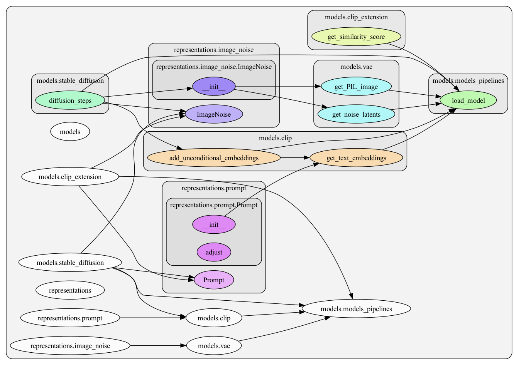

# Controlling Diffusion
Master thesis at Chalmers on: Input-Output Mapping of the Components of a Diffusion Model as a Potential Approach for Enhanced Model Control

The report is published on Chalmers Open Digital Repository at [https://odr.chalmers.se/items/f6e88da5-fb40-42b8-95fc-429fadc403fb](https://odr.chalmers.se/items/f6e88da5-fb40-42b8-95fc-429fadc403fb)

# Call graphs
The call graph of the core modules, i.e. Prompt and ImageNoise classes that represent the input and output of the diffusion model:

The call graph of the complete project:
